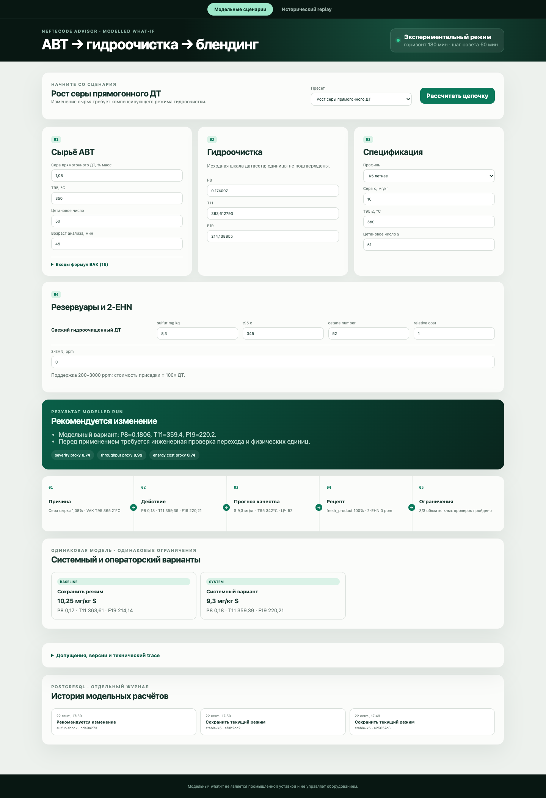

# Результаты Neftecode Advisor

Метрики воспроизводятся командами `prepare`, `train`, `modelled-train`. Производные
артефакты не коммитятся; числа зафиксированы после чистого запуска 22 сентября 2026.

## Historical forecast: продолжение процесса +60 минут

| Сегмент | Модель | n | MAE, мг/кг | q90 coverage | Пропуск превышения | False alarm |
|---|---|---:|---:|---:|---:|---:|
| validation | selected persistence | 28 440 | 0,573 | 90,0% | 15,7% (175/1 116) | 15,7% |
| test | selected persistence | 28 447 | 0,706 | 81,9% | 9,5% (437/4 596) | 26,2% |
| test | HGB challenger | 28 447 | 1,184 | 74,7% | 13,8% | 23,1% |

Разбиение 70/15/15 выполняется по времени. Удалены 6 train и 6 validation origins,
чьи targets пересекали следующую границу. Learned-модель проиграла persistence на
validation, поэтому не выбрана.

## Modelled response audit: горизонт 180 минут

| Параметр | Результат |
|---|---:|
| train / validation / test | 22 786 / 2 456 / 4 458 |
| выбранный лаг | 60 минут |
| Ridge α | 10 |
| validation MAE | 1,153 мг/кг |
| test MAE | 2,122 мг/кг |
| validation q90 | 2,220 мг/кг |
| коэффициенты P8/T11/F19 | 0 / 0 / 0 после sign constraints |

Нулевые коэффициенты — важный отрицательный результат: история не подтверждает causal
эффект доступных действий. Modelled effect поэтому маркируется как допущение и не
подменяет historical forecast.

## Action и blending

| Проверка | Фактический результат |
|---|---|
| Кандидаты | максимум 27; шаг 5% train p5–p95 |
| Joint support | вне диапазона/эллипсоида → `not_assessable` |
| System = operator | равные inputs дают равные quality/proxy/checks |
| Operator wins | preset `operator-wins` выбирает origin `operator` |
| Баланс | доли рецепта суммируются до 100% |
| 2-EHN | nominal +5, hard +4 на 1000 ppm; >3000 → `not_assessable` |
| Infeasible recipe | `no_feasible_option`; cost не обходит hard checks |

Пять preset-сценариев прошли browser E2E через nginx → FastAPI → PostgreSQL:

| Preset | Статус |
|---|---|
| `stable-k5` | `no_change` |
| `sulfur-shock` | `change_recommended` |
| `operator-wins` | `change_recommended`, выбран оператор |
| `missing-data` | `insufficient_data` |
| `cetane-blending` | `no_change`, допустимый рецепт |

## Ограничения и честная интерпретация

- Modelled run не является промышленной уставкой; переход и скорость изменения не оценены.
- P8/T11/F19 показаны в исходной шкале датасета до подтверждения физических единиц.
- Train p5–p95 — область модели, не технологические или safety limits.
- T95 blending, cost, severity и throughput — proxy.
- ЛИМС становится доступным в replay через консервативные 4 часа после отбора.
- Отсутствие обязательной проверки не считается успехом.
- Полная спецификация товарного топлива шире трёх показателей этого сценария.
- Test не использован для выбора модели, лагов, α, диапазонов или q90.
